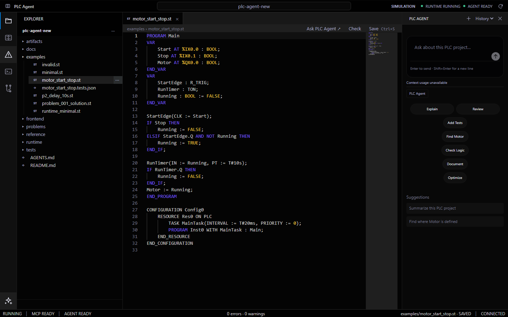

# PLC-Agent

[简体中文](README.md) | [English](README.en.md)

PLC-Agent 是一个面向 IEC 61131-3 结构化文本（ST）的本地开发工具。它提供浏览器工作台、Codex Agent、PLC 工程静态索引，以及基于 MatIEC 和 OpenPLC 测试 Runtime 的编译、仿真调试与行为验证。

项目目前面向**本地仿真和测试**，不支持连接、下载程序到或控制物理 PLC。



## 功能

- **Web IDE**：浏览和编辑 ST 文件，查看编译诊断、工程结构、Agent 执行过程与文件变更。
- **Codex Agent**：在工程内理解需求、修改 ST，并通过 PLC MCP 工具检查和验证结果；可从 Web IDE 或命令行使用。
- **仿真调试**：在 OpenPLC 测试 Runtime 中运行程序，读取变量，Force/Unforce，记录有界 Trace，查看只读 Live Ladder。
- **行为验证**：用 JSON 测试计划设置输入并断言实际输出。只有真实运行的 `passed: true` 才表示该计划通过；编译成功不等于行为正确。

## 环境要求

| 用途 | 所需环境 |
| --- | --- |
| Web IDE | Python 3、Node.js 与 npm；安装 `requirements-phase4.txt` 和前端依赖 |
| ST 检查 | MatIEC `iec2c`，可使用项目提供的 Docker 编译器镜像，或配置本机/WSL 编译器 |
| 仿真、调试和行为验证 | Docker Engine、Docker Compose，以及项目固定版本的 OpenPLC 测试 Runtime；需要支持 `linux/amd64` 容器 |
| Agent | 已安装并认证的 Codex CLI，以及访问模型服务的网络连接 |

Windows 安装 `requirements-phase4.txt` 中的 Tree-sitter ST 语法包时可能需要 C 编译工具链。镜像构建会下载固定版本的 MatIEC、OpenPLC 和其他依赖。项目曾在 Windows 主机及 Docker Linux 容器上完成真实验收；其他主机环境仍需自行验证。

## 快速开始

以下命令在仓库根目录执行。示例使用 PowerShell；macOS/Linux 的虚拟环境激活命令见下文。

### 1. 下载并安装

```powershell
git clone https://github.com/instantgoing/plc-agent.git
cd plc-agent
python -m venv .venv
.\.venv\Scripts\Activate.ps1
python -m pip install -r requirements-phase4.txt
cd frontend
npm ci
npm run build
cd ..
```

macOS/Linux 激活命令是 `source .venv/bin/activate`。直接下载 GitHub ZIP 也可安装当前 Web IDE；若需运行历史 M5 测试，请改用 `git clone --recurse-submodules` 获取 `smolagents` 子模块。当前 Codex/Web IDE 不依赖该子模块。

### 2. 启动 Web IDE

```powershell
python main.py web --workspace .
```

打开 <http://127.0.0.1:8765>。服务只监听本机。`--workspace` 应指向要编辑的 PLC 工程目录；使用仓库根目录时，工程索引也会包含 `examples/` 和 `tests/` 中的 ST 文件。开发前端时可用 `python main.py web --workspace . --dev`，然后打开 <http://127.0.0.1:5173>。

此时可以浏览和编辑文件。要执行检查、仿真或 Agent 任务，还需完成下面的环境配置。

### 3. 配置 MatIEC 与 OpenPLC 测试 Runtime

启动 Docker，然后在仓库根目录构建项目提供的编译器和 Runtime 镜像：

```powershell
docker compose -f runtime/docker-compose.m1.yml build
python runtime/scripts/build_openplc_base.py
docker compose -f runtime/docker-compose.m2.yml build
docker compose -f runtime/docker-compose.m2.yml up -d
```

在仓库根目录创建不提交到 Git 的 `.env.local`，写入：

```dotenv
PLC_MATIEC_BACKEND=docker
PLC_MATIEC_DOCKER_IMAGE=plc-agent-matiec:m1
```

如已安装本机或 WSL MatIEC，可改用其他后端；配置项见 [Runtime 说明](runtime/README.md)。运行 `python main.py check examples/minimal.st` 可先确认真实编译器可用。

### 4. 配置 Codex Agent（可选）

安装 Codex CLI 并运行 `codex login`，或按 Codex CLI 的方式设置 `CODEX_API_KEY`。完成后可在 Web IDE 右侧 Agent 面板提问，也可使用：

```powershell
python main.py agent --workspace . "检查当前 PLC 工程，并说明主要程序结构。"
python main.py chat --workspace .
```

如当前网络需要本地 HTTP 代理，可在 `.env.local` 设置 `PLC_CODEX_PROXY=http://127.0.0.1:PORT` 并重启 Web IDE。旧版 M5 的 `PLC_AGENT_API_KEY` 不是当前 Codex 入口的认证方式。

## 基本使用

Web IDE 左侧选择文件或 PLC 符号，中间编辑 ST，右侧使用 Agent，底部查看 Problems、Runtime、Variables、Watch、Trace、Live Ladder 和 Changes。先保存 ST，再执行 Check 或 Build & Run；仿真程序运行后才能读取实时变量和开始调试。

命令行也可完成一个完整的仿真验证流程：

```powershell
python main.py check examples/problem_001_solution.st
python main.py run examples/problem_001_solution.st
python main.py verify problems/problem_001/tests.json
python main.py stop
```

查看 `verify` 输出中的 `passed`，并在结束时停止测试 Runtime。验证计划只覆盖其中明确列出的输入、输出和时间条件。当前构建接口一次处理一个 ST 文件；Live Ladder 是有限语法子集的只读视图。

## 项目结构

| 路径 | 职责 |
| --- | --- |
| `agent/` | Codex 会话、需求处理和有界修复流程 |
| `plc_tools/` | 稳定的 PLC 工具和 MCP 接口 |
| `runtime/` | MatIEC、Docker 和 OpenPLC 测试 Runtime 适配 |
| `plc_context/` | 从 ST 源文件派生的工程静态索引 |
| `web_ide/` | 本地 FastAPI HTTP/WebSocket 网关 |
| `frontend/` | React、TypeScript、Vite 和 Monaco 工作台 |
| `examples/`、`problems/` | 示例 ST 与行为验证计划 |
| `docs/` | 架构、阶段验收和发布验证记录 |

Agent 通过 `plc_tools/` 使用 PLC 能力，Runtime 实现细节留在 `runtime/`。工程索引是派生数据，ST 源文件始终是工程事实来源。

## 验证状态与限制

Phase 1–5 已有真实 Codex、MatIEC、OpenPLC 和浏览器验收记录。[发布验证](docs/release-validation.md)还记录了独立克隆安装、WebSocket 启动和五步仿真行为验证。最新工作台界面有[构建、前端测试和实际 Agent 界面检查](reference/ours/REPORT.md)；该界面提交尚未单独完成全新克隆的端到端验收。

目前仅支持 MatIEC/OpenPLC **测试仿真环境**。行为正确性的结论仅适用于实际通过的测试计划；物理 PLC 操作、通用多文件编译和 Ladder 编辑均不在当前支持范围内。更多细节见 [架构说明](docs/architecture.md)和 [Phase 5 验收结果](docs/phase5-result.md)。

## 开发检查

```powershell
python -m unittest discover -s tests -v
cd frontend
npm test
npm run build
```

默认 Python 测试中的真实集成场景可能被跳过；需要按对应文档配置 MatIEC/OpenPLC 测试环境后单独运行。历史 M5 测试还需要前述 Git 子模块。
